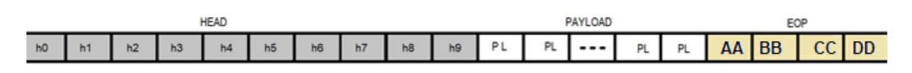
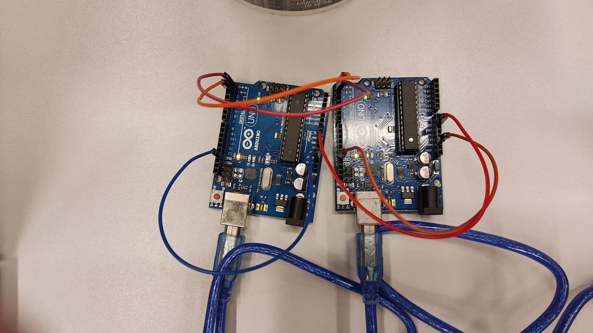

# Projeto 4 de Camada Física da Computação 
## Protocolo de comunicação UART ponto a ponto

### Autores:
* [Matheus Oliveira](https://github.com/matheus-1618)
* [Nívea Abreu](https://github.com/niveaabreu)

 <center></center>

## Descrição:
Implementação de uma aplicação para que sensores (no caso em específico uma imagem) se comunicarem serialmente com padrão UART de maneira segura, sem perda de dados. A comunicação deve ser feita para envio de arquivos para os servidores, sendo uma rotina
de envio executada pelo sensor toda vez que este tem um arquivo a ser enviado.
A camada superior, por padrão deve seguir as especificações abaixo:
 <center></center>

- h0 – tipo de mensagem
- h1 – id do Client
- h2 – id do Servidor
- h3 – número total de pacotes do arquivo
- h4 – número do pacote sendo enviado
- h5 – se tipo for handshake:id do arquivo
- h5 – se tipo for dados: tamanho do payload
- h6 – pacote solicitado para recomeço quando a erro no envio.
- h7 – último pacote recebido com sucesso.
- h8 – h9 – CRC
- PAYLOAD – variável entre 0 e 114 bytes. Reservado à transmissão dos arquivos.
- EOP – 4 bytes: 0xAA 0xBB 0xCC 0xDD

## Protocolo utilizado
Documento de definição do protocolo de comunicação

#### Padrão
UART, baudrate 115200, sem bit de paridade
#### Datagrama
Cada envio deve ser feito como um datagrama completo, contendo head, payload e eop, ou seja, não é permitido envios que não contenham head, payload(ocasionalmente nulo) e EOP. O tamanho do payload não pode ultrapassar 114 bytes e o tamanho do datagrama não deve ser maior que 128 bytes

#### Tipo de mensagens 
- TIPO 1 – Esta mensagem representa um chamado do cliente enviado ao servidor convidando-o para a transmissão. Nesse caso, o head deve conter o byte h0 com o número 1, indicando mensagem tipo 1, e outro byte com um identificador. O identificador é o número do servidor, sendo que quando este receber uma mensagem tipo 1, verifica se é para ele mesmo o envio. A mensagem tipo 1 já deve conter o número total de pacotes que se pretende enviar!
- TIPO 2 – Essa mensagem é enviada pelo servidor ao cliente, após o primeiro receber uma mensagem tipo 1 com o número identificador correto. Deve conter no head o número 2 no byte reservado ao tipo de mensagem. O significado de uma mensagem tipo 2 é que o servidor está ocioso e, portanto, pronto para receber o envio dos pacotes. 
- TIPO 3 – A mensagem tipo 3 é a mensagem de dados. Este tipo de mensagem contém de fato um bloco do dado a ser enviado (payload). Deve conter o número 3 no byte reservado ao tipo de mensagem. Essa mensagem deve conter também o número do pacote que envia (começando do 1) e o total de pacotes a serem enviados.
- TIPO 4 – Essa mensagem é enviada do servidor para o cliente toda vez que uma mensagem tipo 3 é recebida pelo servidor e averiguada. Quando verificado que a mensagem é realmente o pacote que o servidor estava esperando e que tal mensagem chegou em perfeitas condições (eop no local correto), o servidor envia então a mensagem tipo 4, afirmando que recebeu o pacote. Essa mensagem deve ter o número 4 no byte reservado ao tipo de mensagem. Além disso, deve conter o número do último pacote recebido e já aferido.
- TIPO 5 – É uma mensagem de time out. Toda vez que o limite de espera exceder o timer dedicado a isso, em qualquer um dos lados, deve-se enviar essa mensagem e finalizar a conexão. Essa mensagem deve ter o número 5 no byte reservado ao tipo de mensagem.
- TIPO 6 – É uma mensagem de erro. O servidor deve enviar esta mensagem ao cliente toda vez que receber uma mensagem tipo 3 inválida, seja por estar com bytes faltando, fora do formato correto ou por não ser o pacote esperado pelo servidor (pacote repetido ou fora da ordem). Essa mensagem deve ter o número 6 no byte reservado ao tipo de mensagem. Além disso, deve conter o número correto do pacote esperado pelo servidor na posição h6, independentemente do problema que invalidou a mensagem. Isso orienta sempre o cliente para o reenvio.


## Simulação
Foram simulados cinco tipos de casos:
- SUCESSO DE TRANSMISSÃO: Envia o arquivo de forma adequada, confirmando o recebimento de Acknowledges e mantendo conexão com servidor a todo tempo.

- ERROS DE CONEXÃO: Ao remover fios (de pinos RX ou TX), provavelmente erros de transmissão sejam pelo não envio dos dados ou recebimento correto destes,a transmissão notará os erros e ao reconectar os cabos com menos de 20s, a transmissão seguirá normamelmente do último pacote enviado e recebido adequadamente.

- TIMEOUT: Client não recebe resposta do handshake do Server e pergunta ao usuário se ele deseja tentar o envio novamente, persistindo até que a conexão seja estabelecida ou finalizada.

- ERRO DE TRANSMISSÃO DE PACOTE: Client envia um pacote não correspondente ao esperado pelo server (em termos de sucessividade), e dessa forma o Server reaje parando momentaneamente a a recepção enviando um acknowledge ao Client solicitando o reenvio do pacote desejado; o client então reenvia o pacote e a transmissão retorna de onde parou.

- ERRO DE TRANSMISSÃO DE PAYLOAD: Client envia um pacote com tamanho de payload não correspondente ao esperado pelo server (maior ou menor ao lido pelo RX), e dessa forma o Server reaje parando momentaneamente a a recepção enviando um acknowledge ao Client solicitando o reenvio do pacote desejado; o client então reenvia o pacote e a transmissão retorna de onde parou.


## Montagem

Para montagem, use dois Arduinos uno e 5 jumpers, para ligar os terminais TX e RX cruzado de cada Arduino, e depois conecte cada arduino a um computador (ou ao mesmo se for caso, mas em portas diferentes).
<center></center>

Para realizar a simulação, abra um terminal na pasta server e execute o comando abaixo, e selecione o caso a ser simulado:

```console
 borg@borg:~ python aplicacao_server.py
```
Simultaneamente, abra outro terminal, em outro computador conectado ao arduino, ou em relação a outra porta no mesmo computador e execute, dentro da pasta client. o comando baixo, dando inicio a transmissão e recebimento dos dados:
```console
 borg@borg:~ python aplicacao_client.py
```
Assim, poderão ser simulados os casos de transmissão e recepção entre computadores ou portas diferentes, garantindo comunicação ou simulando casos de erro.

 ©Insper, 4° Semestre Engenharia da Computação, Camada Física da Computação.
